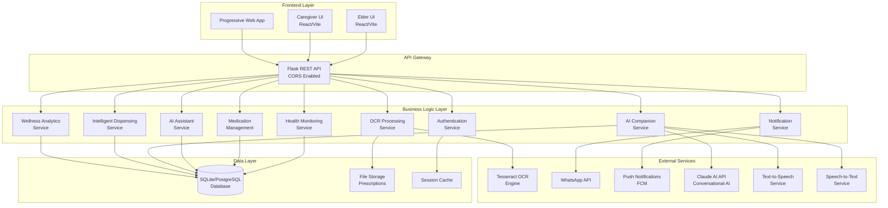
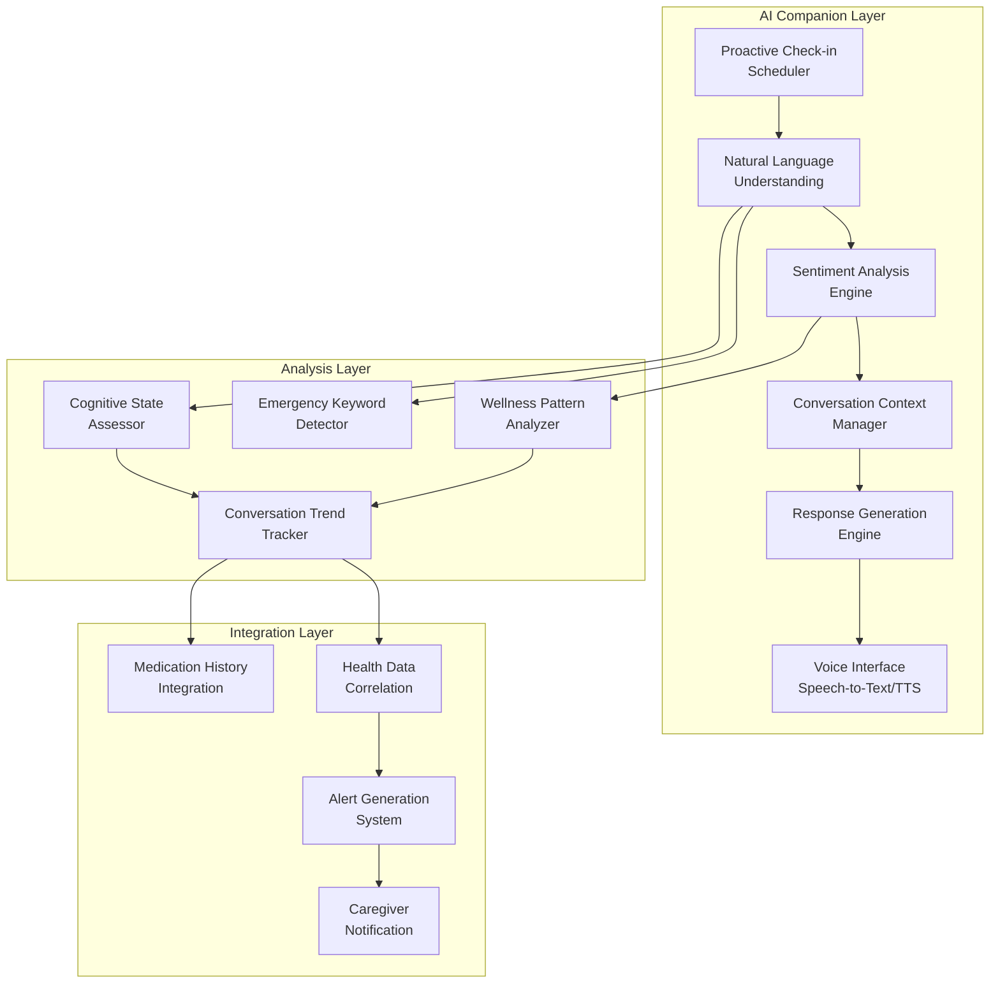
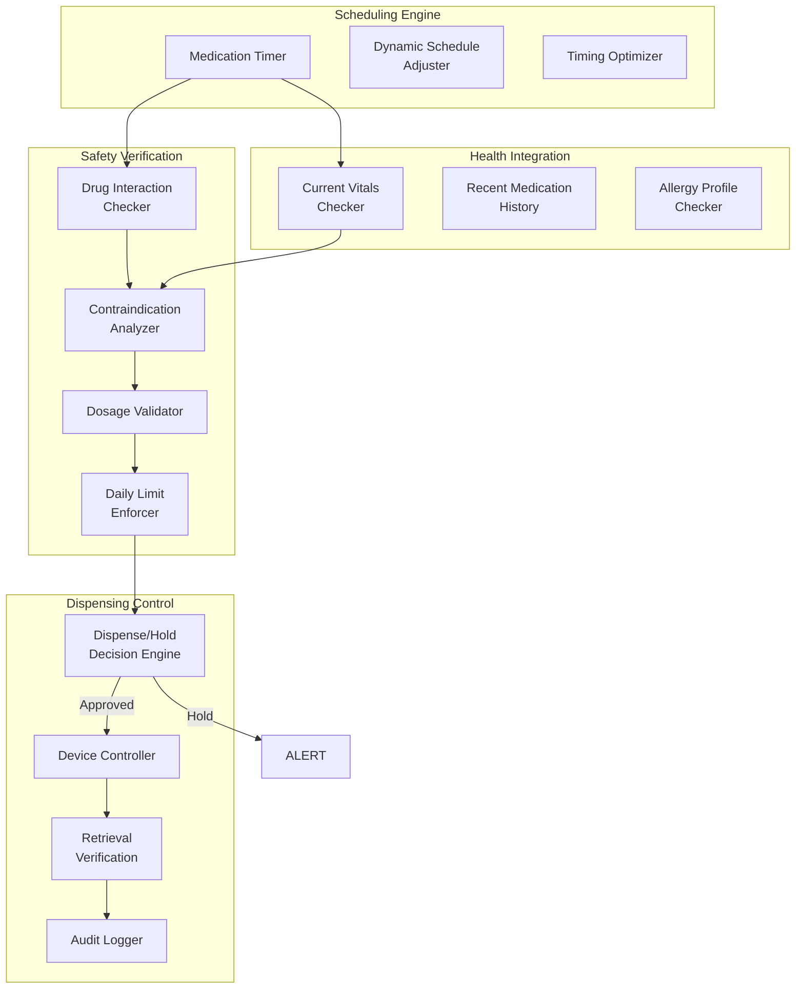

# Design Document

## Overview

AgeWell is a comprehensive elderly care platform featuring AI-powered health monitoring, intelligent medication dispensing, and proactive companionship. Built with React/Vite frontend and Python/Flask backend, the system provides dual interfaces: simplified, accessible UI for elderly users and comprehensive analytics for caregivers.

Key innovations include:
- **AI Companion**: Proactive conversational check-ins with sentiment analysis and emergency detection
- **Intelligent Dispensing**: Multi-stage safety verification with contraindication checking
- **Predictive Analytics**: Cross-correlation analysis for early intervention
- **Seamless Integration**: OCR prescription processing and multi-channel notifications

## Architecture

### System Architecture



### AI Conversational Companion Architecture



### Intelligent Dispensing Algorithm Architecture



### Technology Stack

**Frontend:**
- React 18 with Vite build system
- TailwindCSS for responsive styling
- Recharts for data visualization
- Lucide React for icons
- React Router for navigation
- Framer Motion for animations

**Backend:**
- Flask 3.0 web framework
- SQLAlchemy ORM with SQLite/PostgreSQL
- Flask-CORS for cross-origin requests
- Python-dotenv for configuration
- Pillow for image processing

**AI & Processing:**
- Claude API for conversational AI companion
- Custom health analysis algorithms with statistical trend detection
- Tesseract OCR for prescription processing
- Multi-stage medication safety verification
- Predictive wellness pattern analysis

**Infrastructure:**
- RESTful API design
- File-based session management
- Structured logging
- Environment-based configuration

## Components and Interfaces

### Frontend Components

### Frontend Components

#### Elder User Interface
- **ElderDashboard**: Large "I'm OK" check-in, medication summary, AI companion chat
- **ElderMeds**: Current medications with large fonts and visual feedback
- **ElderHealth**: Simple vital sign input with trend indicators
- **ElderEmergency**: Large emergency buttons with direct caregiver notification

#### Caregiver Interface  
- **FamilyDashboard**: Real-time status, active alerts, adherence summary, trend charts
- **HealthMonitor**: Detailed metrics, interactive charts, threshold configuration
- **FamilyMeds**: Comprehensive medication management and adherence tracking
- **PrescriptionUpload**: OCR processing with drag-and-drop and review interface

### Backend API Routes

#### Core Routes
```python
# Health Management
POST /api/health/readings          # Add health reading
GET  /api/health/readings/{user_id} # Get readings with filtering
GET  /api/health/stats/{user_id}    # Statistical analysis

# Medication Management  
POST /api/medications/             # Add medication
GET  /api/medications/{user_id}    # Get user medications
POST /api/medications/adherence    # Log adherence
GET  /api/medications/schedule/{user_id} # Get schedule

# User Management
POST /api/users/                   # Create user
POST /api/users/check-in          # Daily wellness check-in
POST /api/users/link-caregiver    # Link caregiver relationship

# Prescription Processing
POST /api/prescriptions/upload     # Upload prescription image
GET  /api/prescriptions/{user_id}  # Get user prescriptions

# AI & Alerts
GET  /api/ai/analyze/{user_id}     # Comprehensive analysis
GET  /api/ai/alerts/{user_id}      # Get active alerts
POST /api/ai/alerts/{id}/acknowledge # Acknowledge alert
```

#### AI Companion Routes
```python
POST /api/ai-companion/check-in/{user_id}    # Initiate check-in
POST /api/ai-companion/respond               # Process user response
GET  /api/ai-companion/history/{user_id}     # Conversation history
GET  /api/ai-companion/wellness/{user_id}    # Wellness analysis
```

#### Intelligent Dispensing Routes
```python
POST /api/dispensing/evaluate-dispense       # Safety evaluation
POST /api/dispensing/dispense               # Execute dispensing
POST /api/dispensing/confirm-retrieval      # Confirm retrieval
GET  /api/dispensing/history/{user_id}      # Dispensing history
GET  /api/dispensing/performance/{user_id}  # Algorithm metrics
```

### Service Layer Components

#### AI Companion Service
- **ConversationManager**: State management, history, proactive scheduling
- **SentimentAnalyzer**: NLP sentiment analysis and mood tracking  
- **CognitiveAssessor**: Coherence evaluation and confusion detection
- **EmergencyDetector**: Real-time keyword monitoring and alert triggering
- **ResponseGenerator**: Context-aware, empathetic response generation
- **WellnessPatternAnalyzer**: Longitudinal analysis and risk scoring

#### Intelligent Dispensing Service
- **SafetyVerificationEngine**: Drug interactions, contraindications, allergies
- **VitalSignsIntegrationService**: Real-time health data correlation
- **DynamicScheduler**: Optimal timing with food/sleep considerations
- **DispenseDecisionEngine**: Multi-factor safety decision algorithm
- **DeviceController**: Hardware interface and mechanical monitoring
- **LearningOptimizer**: Pattern-based optimization and predictions

#### Core Services
- **HealthAnalyzer**: Threshold detection, trend analysis, alert generation
- **MedicationAnalyzer**: Adherence calculation, pattern recognition
- **OCRProcessor**: Tesseract integration, parsing, validation
- **NotificationService**: Multi-channel delivery with retry logic

## Data Models

### Core Models

```python
class User:
    id: Integer (Primary Key)
    name: String(100)
    age: Integer
    phone: String(20) (Unique)
    role: String(20) # 'elderly' or 'caregiver'
    linked_user_id: Integer (Foreign Key to User)
    created_at: DateTime

class HealthReading:
    id: Integer (Primary Key)
    user_id: Integer (Foreign Key)
    spo2: Float
    heart_rate: Float
    temperature: Float
    blood_pressure_systolic: Float
    blood_pressure_diastolic: Float
    timestamp: DateTime
    notes: Text

class Medication:
    id: Integer (Primary Key)
    user_id: Integer (Foreign Key)
    name: String(200)
    dosage: String(100)
    frequency: String(100)
    type: String(20) # 'pill' or 'liquid'
    slot_number: Integer # Device slot 1-10
    schedule_times: JSON
    special_instructions: Text
    start_date: Date
    end_date: Date (Optional)
    active: Boolean
    created_at: DateTime

class Alert:
    id: Integer (Primary Key)
    user_id: Integer (Foreign Key)
    alert_type: String(50) # 'health', 'medication', 'check_in', 'ai_companion'
    severity: String(20) # 'low', 'medium', 'high', 'critical'
    title: String(200)
    message_elderly: Text
    message_caregiver: Text
    triggered_by: JSON
    status: String(20) # 'active', 'acknowledged', 'resolved'
    notification_sent: Boolean
    created_at: DateTime
    resolved_at: DateTime (Optional)
```

### AI Companion Models

```python
class AIConversation:
    id: Integer (Primary Key)
    user_id: Integer (Foreign Key)
    timestamp: DateTime
    conversation_type: String(50) # 'check_in', 'emergency', 'general'
    user_message: Text
    ai_response: Text
    interaction_mode: String(20) # 'voice', 'text', 'button'
    
    # Analysis Results
    sentiment_score: Float # -1.0 to 1.0
    sentiment_label: String(20) # 'positive', 'neutral', 'negative', 'distressed'
    cognitive_clarity_score: Float # 0.0 to 1.0
    emergency_detected: Boolean
    emergency_keywords: JSON
    
    # Health Indicators
    pain_mentioned: Boolean
    pain_severity: Integer # 1-10 scale
    pain_location: String(100)
    confusion_indicators: Boolean
    mood_assessment: String(50)
    
    # Context
    topics_discussed: JSON
    follow_up_needed: Boolean
    caregiver_notified: Boolean
    alert_generated_id: Integer (Foreign Key to Alert)

class WellnessPattern:
    id: Integer (Primary Key)
    user_id: Integer (Foreign Key)
    analysis_date: Date
    
    # Conversation Patterns (7-day window)
    avg_sentiment_score: Float
    sentiment_trend: String(20) # 'improving', 'stable', 'declining'
    conversation_frequency: Integer
    engagement_level: String(20) # 'high', 'normal', 'low', 'concerning'
    
    # Cognitive & Health Indicators
    avg_cognitive_clarity: Float
    confusion_episodes: Integer
    pain_mentions: Integer
    mood_distribution: JSON
    
    # Predictive Indicators
    decline_risk_score: Float # 0.0 to 1.0
    intervention_recommended: Boolean
    intervention_type: String(100)
```

### Intelligent Dispensing Models

```python
class MedicationDispenseEvent:
    id: Integer (Primary Key)
    user_id: Integer (Foreign Key)
    medication_id: Integer (Foreign Key)
    scheduled_time: DateTime
    
    # Decision Process
    decision_timestamp: DateTime
    decision: String(20) # 'dispensed', 'held', 'skipped', 'manual_override'
    decision_reasoning: Text
    
    # Safety Checks
    interaction_check_passed: Boolean
    contraindication_check_passed: Boolean
    dosage_verified: Boolean
    daily_limit_verified: Boolean
    
    # Health Context
    current_spo2: Float
    current_heart_rate: Float
    current_blood_pressure: String
    current_temperature: Float
    
    # Dispensing Details
    actual_dispense_time: DateTime
    slot_number: Integer
    quantity_dispensed: Float
    retrieval_confirmed: Boolean
    retrieval_time: DateTime
    
    # Overrides & Audit
    caregiver_override: Boolean
    override_authorized_by: String(100)
    audit_trail: JSON

class AdherenceLog:
    id: Integer (Primary Key)
    user_id: Integer (Foreign Key)
    medication_id: Integer (Foreign Key)
    scheduled_time: DateTime
    taken_time: DateTime (Optional)
    status: String(20) # 'pending', 'taken', 'missed', 'late'
    dispensing_attempts: Integer
    notes: Text
    created_at: DateTime
```

### Supporting Models

```python
class Prescription:
    id: Integer (Primary Key)
    user_id: Integer (Foreign Key)
    image_path: String(500)
    ocr_text: Text
    parsed_data: JSON
    processing_status: String(20) # 'pending', 'processing', 'completed', 'failed'
    uploaded_at: DateTime
    processed_at: DateTime (Optional)

class DailyCheckIn:
    id: Integer (Primary Key)
    user_id: Integer (Foreign Key)
    check_in_date: Date
    check_in_time: DateTime (Optional)
    status: String(20) # 'pending', 'completed', 'missed'
    mood: String(50)
    notes: Text
```

## Correctness Properties

*Properties define behaviors that must hold true across all valid system executions, serving as formal specifications for testing and verification.*

### Core System Properties

**Property 1: User Authentication and Role Management**
*For any* user registration with valid role specification, the system should create accounts with correct role assignment and secure session management
**Validates: Requirements 1**

**Property 2: Health Data Management**
*For any* valid health reading submission, the system should store data with timestamps, analyze against thresholds, and generate critical alerts for dangerous values (SpO₂ < 90%, HR < 50 or > 120, temp < 35°C or > 38.5°C)
**Validates: Requirements 2**

**Property 3: Medication Safety and Dispensing**
*For any* scheduled medication time, the dispensing algorithm should execute multi-stage safety verification (interactions, contraindications, dosage limits) and hold dispensing when safety issues detected
**Validates: Requirements 3**

**Property 4: Prescription Processing Consistency**
*For any* valid prescription data, parsing then printing then parsing should produce equivalent medication schedules (round-trip property)
**Validates: Requirements 4**

### AI Companion Properties

**Property 5: Proactive Companion Check-ins**
*For any* 4-5 hour period without Elder_User interaction, the AI_Companion should initiate appropriate check-in conversations with sentiment analysis and emergency detection
**Validates: Requirements 5.1, 5.2**

**Property 6: Pain and Cognitive Assessment**
*For any* Elder_User mention of pain or confusion indicators, the AI_Companion should assess severity, ask clarifying questions, and alert caregivers when appropriate
**Validates: Requirements 5.3, 5.4**

**Property 7: Conversation History and Pattern Analysis**
*For any* AI_Companion interaction, the system should maintain conversation history, track mood patterns, and generate wellness alerts when concerning patterns emerge
**Validates: Requirements 5.6, 5.7**

**Property 8: Predictive Wellness Analytics**
*For any* wellness monitoring period, the system should perform cross-correlation analysis between health readings, medication adherence, and conversation patterns to generate predictive alerts
**Validates: Requirements 5.8, 5.9**

### Intelligent Dispensing Properties

**Property 9: Multi-Stage Safety Verification**
*For any* medication dispensing request, the system should verify drug interactions, contraindications with current vitals, dosage limits, and allergy profiles before approval
**Validates: Requirements 3.2**

**Property 10: Contraindication Hold Logic**
*For any* health readings indicating contraindications (e.g., low heart rate + beta-blockers), the system should automatically hold dispensing and alert caregivers with specific reasoning
**Validates: Requirements 3.3**

**Property 11: Retrieval Monitoring and Escalation**
*For any* dispensed medication not retrieved within 5 minutes, the system should escalate through reminders, AI companion check-in, and caregiver alerts
**Validates: Requirements 3.4**

**Property 12: Learning and Optimization**
*For any* medication dispensing patterns over time, the system should learn optimal timing, suggest schedule adjustments, and predict adherence risks
**Validates: Requirements 3.6**

### Notification and Alert Properties

**Property 13: Multi-Channel Critical Alerts**
*For any* critical health or safety alert, the system should send immediate notifications to both Elder_User and Caregiver through appropriate channels with role-specific messaging
**Validates: Requirements 6**

**Property 14: Alert Escalation and Acknowledgment**
*For any* unacknowledged critical alert, the system should escalate after defined time periods, and properly update status when acknowledged
**Validates: Requirements 6**

### User Interface Properties

**Property 15: Elder Interface Accessibility**
*For any* elder user interface element, the system should use large fonts (≥18px), high contrast colors, simple navigation, and touch-friendly design
**Validates: Requirements 8**

**Property 16: Caregiver Analytics Completeness**
*For any* caregiver dashboard access, the system should display comprehensive status overview with alerts, adherence rates, trend analysis, and drill-down capabilities
**Validates: Requirements 8**

### Security and Performance Properties

**Property 17: Data Security and Access Control**
*For any* health data access or modification, the system should enforce role-based access control, maintain audit logs, and encrypt data in transit and at rest
**Validates: Requirements 9**

**Property 18: System Performance and Reliability**
*For any* user interaction under normal load, the system should respond within 2 seconds, process OCR within 30 seconds, and maintain cross-platform consistency
**Validates: Requirements 10**

**Property 19: Daily Check-In Management**
*For any* daily check-in process, the system should provide simple one-touch interface, track patterns, and escalate missed check-ins to caregivers appropriately
**Validates: Requirements 7**

**Property 20: Comprehensive Audit Trail**
*For any* dispensing decision, safety check, or alert generation, the system should maintain detailed audit trails with reasoning, timestamps, and override authorizations
**Validates: Requirements 3.10, 9**

## Algorithm Specifications

### Intelligent Medication Dispensing Algorithm

```python
def evaluate_medication_dispense(medication, user, scheduled_time):
    """
    Multi-stage safety verification before dispensing medication
    Returns: (decision, reasoning, warnings)
    """
    
    decision_log = []
    warnings = []
    
    # STAGE 1: Retrieve Current Context
    current_vitals = get_latest_health_readings(user, within_hours=2)
    recent_medications = get_recent_medications(user, within_hours=24)
    user_allergies = get_user_allergies(user)
    
    # STAGE 2: Drug Interaction Check
    for recent_med in recent_medications:
        interaction = check_drug_interaction(medication, recent_med)
        if interaction.severity == "critical":
            return ("HOLD", f"Critical interaction with {recent_med.name}", [interaction])
        elif interaction.severity == "major":
            warnings.append(interaction)
            decision_log.append(f"Major interaction detected: {interaction.description}")
    
    # STAGE 3: Allergy Verification
    for allergy in user_allergies:
        if medication_contains_allergen(medication, allergy):
            return ("HOLD", f"Allergy alert: {allergy}", [])
    
    # STAGE 4: Vital Signs Contraindication Check
    contraindications = check_contraindications(medication, current_vitals)
    
    # Example contraindication rules:
    if medication.category == "beta_blocker":
        if current_vitals.heart_rate < 60:
            return ("HOLD", "Heart rate too low for beta-blocker",
                    [f"Current HR: {current_vitals.heart_rate} bpm"])
    
    if medication.category == "blood_pressure":
        if current_vitals.systolic < 100:
            return ("HOLD", "Blood pressure too low for BP medication",
                   [f"Current BP: {current_vitals.systolic}/{current_vitals.diastolic}"])
    
    if medication.category == "anticoagulant":
        if user.recent_fall_detected(within_hours=48):
            warnings.append("Recent fall detected - anticoagulant caution")
    
    # STAGE 5: Dosage & Daily Limit Verification
    daily_total = calculate_daily_medication_total(user, medication, date=today)
    if daily_total + medication.dosage > medication.max_daily_dose:
        return ("HOLD", "Maximum daily dose would be exceeded",
               [f"Already taken: {daily_total}, Max: {medication.max_daily_dose}"])
    
    # STAGE 6: Timing Verification
    last_dose_time = get_last_dose_time(user, medication)
    if last_dose_time:
        time_since_last = scheduled_time - last_dose_time
        if time_since_last < medication.minimum_interval:
            return ("HOLD", "Too soon since last dose",
                   [f"Must wait {medication.minimum_interval - time_since_last} more"])
    
    # STAGE 7: Food/Stomach Requirement Check
    if medication.take_with_food:
        last_meal = get_last_meal_time(user)
        if not last_meal or (scheduled_time - last_meal) > hours(4):
            warnings.append("Should be taken with food - user may need meal first")
    
    # STAGE 8: Decision
    if len(contraindications) > 0:
        return ("REQUIRES_OVERRIDE", "Contraindications detected",
                contraindications + warnings)
    
    if len(warnings) > 0:
        return ("APPROVED_WITH_WARNINGS", "Safe to dispense with cautions", warnings)
    
    return ("APPROVED", "All safety checks passed", [])

def dynamic_schedule_optimizer(user, medications):
    """
    Optimize medication timing for better adherence and efficacy
    """
    
    # Get user's daily routine
    wake_time = user.typical_wake_time  # e.g., 7:00 AM
    sleep_time = user.typical_sleep_time  # e.g., 10:00 PM
    meal_times = user.typical_meal_times  # [8:00 AM, 1:00 PM, 7:00 PM]
    
    optimized_schedule = []
    
    for med in medications:
        if med.frequency == "once_daily":
            # Prefer morning for most medications
            if med.take_with_food:
                optimal_time = meal_times[0]  # Breakfast
            else:
                optimal_time = wake_time + minutes(30)
        
        elif med.frequency == "twice_daily":
            # Space evenly, consider food requirements
            if med.take_with_food:
                optimal_times = [meal_times[0], meal_times[2]]  # Breakfast, dinner
            else:
                interval = (sleep_time - wake_time) / 2
                optimal_times = [wake_time + minutes(30), wake_time + interval]
        
        elif med.frequency == "three_times_daily":
            if med.take_with_food:
                optimal_times = meal_times  # All three meals
            else:
                interval = (sleep_time - wake_time) / 3
                optimal_times = [
                    wake_time + minutes(30),
                    wake_time + interval,
                    wake_time + (interval * 2)
                ]
        
        # Check for conflicts with other medications
        for time in optimal_times:
            conflicts = check_timing_conflicts(time, medications, optimized_schedule)
            if conflicts:
                time = resolve_timing_conflict(time, conflicts)
        
        optimized_schedule.append({
            "medication": med,
            "time": time,
            "reasoning": get_timing_reasoning(med, time)
        })
    
    return optimized_schedule

def adherence_risk_predictor(user, medication):
    """
    Predict likelihood of medication non-adherence
    Returns risk score 0.0-1.0 and contributing factors
    """
    
    risk_score = 0.0
    risk_factors = []
    
    # Historical adherence
    historical_adherence = calculate_adherence_rate(user, medication, days=30)
    if historical_adherence < 0.7:
        risk_score += 0.3
        risk_factors.append("Poor historical adherence")
    
    # Side effects
    side_effect_complaints = count_side_effect_mentions(user, medication)
    if side_effect_complaints > 2:
        risk_score += 0.2
        risk_factors.append("Frequent side effect complaints")
    
    # Complexity
    daily_doses = len(medication.schedule_times)
    if daily_doses > 2:
        risk_score += 0.1
        risk_factors.append("Complex dosing schedule")
    
    # Timing conflicts
    meal_conflicts = check_meal_timing_conflicts(user, medication)
    if meal_conflicts:
        risk_score += 0.15
        risk_factors.append("Meal timing conflicts")
    
    # Cognitive factors
    recent_confusion = count_confusion_episodes(user, days=7)
    if recent_confusion > 0:
        risk_score += 0.25
        risk_factors.append("Recent cognitive concerns")
    
    return min(risk_score, 1.0), risk_factors
```

### Wellness Pattern Analysis Algorithm

```python
def analyze_wellness_patterns(user, days=7):
    """
    Comprehensive wellness pattern analysis combining conversation,
    health, and medication data
    """
    
    # Gather data sources
    conversations = get_ai_conversations(user, days=days)
    health_readings = get_health_readings(user, days=days)
    medication_logs = get_adherence_logs(user, days=days)
    
    # Conversation analysis
    sentiment_scores = [c.sentiment_score for c in conversations]
    avg_sentiment = sum(sentiment_scores) / len(sentiment_scores) if sentiment_scores else 0
    
    # Detect trends
    sentiment_trend = calculate_trend(sentiment_scores)
    engagement_level = assess_engagement_level(conversations)
    
    # Cognitive assessment
    cognitive_scores = [c.cognitive_clarity_score for c in conversations]
    avg_cognitive_clarity = sum(cognitive_scores) / len(cognitive_scores) if cognitive_scores else 1.0
    
    # Health correlation
    pain_mentions = sum(1 for c in conversations if c.pain_mentioned)
    confusion_episodes = sum(1 for c in conversations if c.confusion_indicators)
    
    # Risk assessment
    decline_indicators = []
    
    if sentiment_trend == "declining" and avg_sentiment < -0.2:
        decline_indicators.append("Mood deterioration")
    
    if avg_cognitive_clarity < 0.7:
        decline_indicators.append("Cognitive concerns")
    
    if pain_mentions > days * 0.3:  # More than 30% of days
        decline_indicators.append("Frequent pain reports")
    
    # Calculate overall risk score
    risk_score = calculate_wellness_risk_score(
        avg_sentiment, sentiment_trend, avg_cognitive_clarity,
        pain_mentions, confusion_episodes, engagement_level
    )
    
    # Generate recommendations
    recommendations = generate_wellness_recommendations(
        risk_score, decline_indicators, conversations, health_readings
    )
    
    return {
        "risk_score": risk_score,
        "sentiment_trend": sentiment_trend,
        "engagement_level": engagement_level,
        "decline_indicators": decline_indicators,
        "recommendations": recommendations,
        "intervention_needed": risk_score > 0.6
    }
```

### Error Categories and Strategies

**User Input Errors**
- Invalid health readings (out of range values)
- Malformed medication data
- Invalid file uploads
- Authentication failures

*Strategy:* Client-side validation with server-side verification, user-friendly error messages, and guidance for correction.

**System Processing Errors**
- OCR processing failures
- AI analysis errors
- Database connection issues
- External service failures

*Strategy:* Graceful degradation, fallback mechanisms, detailed logging, and user notification with alternative actions.

**Integration Errors**
- WhatsApp API failures
- Push notification service errors
- File storage issues
- Network connectivity problems

*Strategy:* Retry mechanisms with exponential backoff, alternative delivery methods, offline capability, and comprehensive error logging.

**Security Errors**
- Unauthorized access attempts
- Session timeout
- Invalid authentication tokens
- Suspicious activity detection

*Strategy:* Immediate security response, audit logging, user notification, and automatic protective measures.

### Error Recovery Mechanisms

**Automatic Recovery**
- Database connection retry with connection pooling
- Failed notification retry with alternative channels
- OCR reprocessing with different parameters
- Session refresh for expired tokens

**Manual Recovery**
- Manual prescription data entry when OCR fails
- Alternative medication reminder methods
- Manual health data correction
- Emergency contact procedures

**Graceful Degradation**
- Basic functionality when AI services are unavailable
- Cached data display when real-time updates fail
- Simplified UI when advanced features are unavailable
- Essential alerts even when notification services fail

## Testing Strategy

### Dual Testing Approach

**Unit Tests**: Specific examples, edge cases, integration points, UI interactions, API endpoints
**Property-Based Tests**: Universal properties across all inputs, comprehensive coverage through randomization, correctness properties validation

### Property-Based Testing Configuration

- **Framework**: Hypothesis (Python backend), fast-check (JavaScript frontend)
- **Iterations**: Minimum 100 per property test
- **Tagging**: `Feature: agewell-complete-application, Property {number}: {description}`

### Test Coverage Requirements

**Backend**: Service layer functions, all 20 correctness properties, API endpoints, database transactions, OCR processing
**Frontend**: Component tests, user interaction flows, cross-browser compatibility, responsive design, accessibility
**End-to-End**: Complete workflows, alert flows, prescription processing, health monitoring, emergency scenarios

### Performance & Security Testing

**Performance**: Load testing, stress testing, response time measurement, OCR processing performance
**Security**: Authentication, input validation, SQL injection prevention, XSS prevention, data encryption verification
