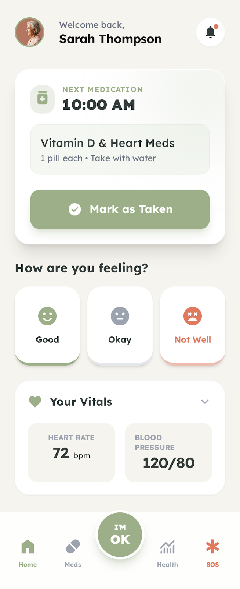
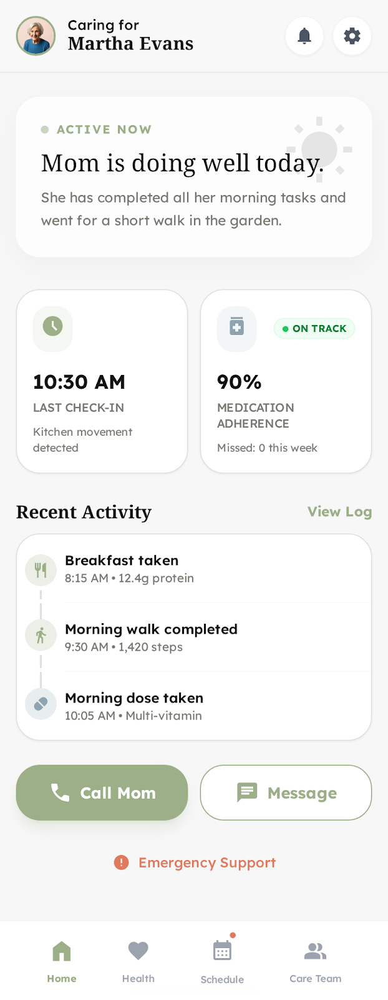
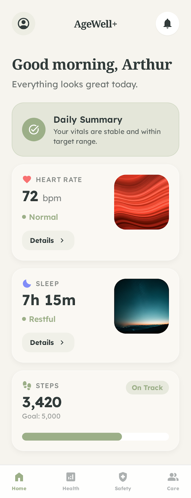
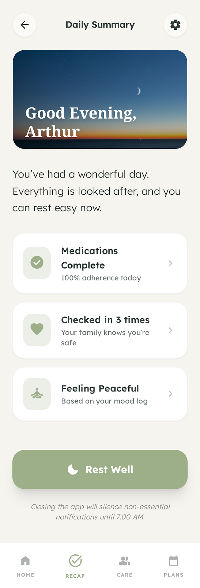
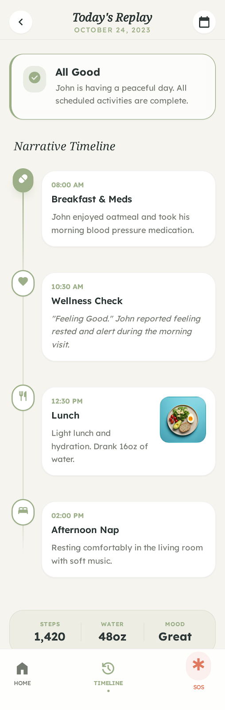
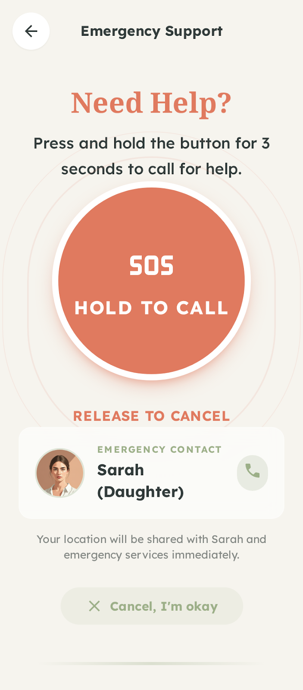
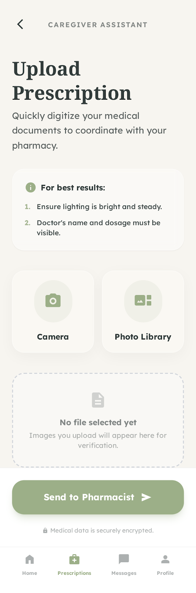
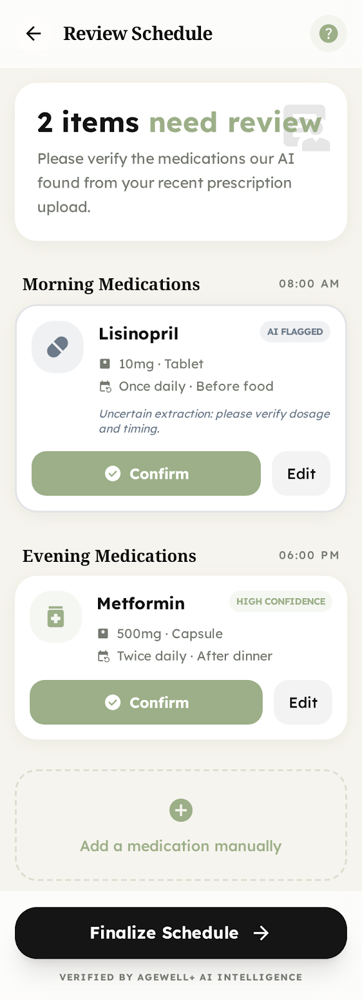
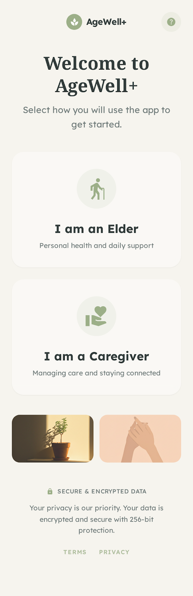

# AgeWell 🌟

> A comprehensive elderly care platform combining medication management, health monitoring, and AI assistance


[](https://www.python.org/downloads/)
[](https://reactjs.org/)
[](https://flask.palletsprojects.com/)
[](https://github.com/tesseract-ocr/tesseract)

## 📸 Project Mockups

### Core Interfaces

| **Elder Dashboard** | **Family Dashboard** |
|:---:|:---:|
|  |  |

### Medication & Health

| **Today's Medications** | **Health Snapshot** |
|:---:|:---:|
|  |  |

### Care & Review

| **Daily Summary** | **Day Replay** |
|:---:|:---:|
|  |  |

### Utilities

| **Emergency Support** | **Upload Prescription** |
|:---:|:---:|
|  |  |

| **Review Schedule** | **Welcome Screen** |
|:---:|:---:|
|  |  |


## 🎯 Overview

AgeWell is an intelligent, AI-powered platform designed to support elderly users and their caregivers in managing medications, monitoring health, and ensuring safety and independence. Our mission is to enhance the quality of life for elderly individuals while providing peace of mind to their caregivers.

### ✨ Key Features

- 🏥 **Real-time Health Monitoring**: Track SpO₂, heart rate, temperature, and blood pressure
- 💊 **Medication Management**: Automated scheduling, adherence tracking, and reminders
- 🤖 **AI Assistant**: Proactive health analysis, anomaly detection, and personalized alerts
- 📝 **Prescription OCR**: Automatic extraction of medication details from prescription images
- 🎯 **Dual Interface**: Elderly-friendly large UI and detailed caregiver dashboard
- 📱 **Smart Notifications**: WhatsApp and push notifications for critical alerts

## 🏗️ Architecture

### 🔧 Tech Stack

#### Backend
- **Framework**: Flask (Python)
- **Database**: SQLAlchemy + SQLite/PostgreSQL
- **AI Services**: Custom health analysis engine
- **OCR**: Tesseract 5.5.0
- **APIs**: RESTful endpoints
- **Notifications**: WhatsApp & Push notifications

#### Frontend
- **Framework**: React 18 + Vite
- **Styling**: TailwindCSS
- **State**: Context API
- **Charts**: Recharts
- **Icons**: Lucide React
- **Routing**: React Router v6

### 📁 Project Structure

```
backend/
├── app.py              # Application entry point
├── models.py           # Database models
├── routes/            # API endpoints
│   ├── health_routes.py
│   ├── medication_routes.py
│   └── user_routes.py
└── services/         # Business logic
    ├── ai_assistant.py
    └── ocr_service.py

frontend/
├── src/
│   ├── pages/        # React components
│   ├── api/          # API client
│   └── contexts/     # React Context
└── public/          # Static assets
```

## ✨ Features

### 👴 For Elderly Users

- **Accessible Interface**
  - Large, easy-to-read text and buttons
  - Simple navigation
  - High-contrast color scheme
  - Voice-guided interactions

- **Daily Wellness**
  - Quick "I'm OK" check-in
  - Simple vital sign input
  - Medication reminders
  - Emergency assistance button

- **Smart Assistance**
  - Clear medication instructions
  - Gentle, friendly reminders
  - Non-technical alert messages
  - Voice-enabled help

### 👥 For Caregivers

- **Smart Dashboard**
  - Real-time status overview
  - Alert management center
  - Health analytics & reports
  - Medication adherence tracking

- **AI-Powered Insights**
  - Health trend analysis
  - Behavior pattern detection
  - Risk assessment
  - Predictive alerts

### 🤖 AI Assistant Features

- **Health Analysis**
  - Vital sign monitoring
  - Trend detection
  - Multi-metric correlation
  - Anomaly detection

- **Medication Management**
  - Adherence tracking
  - Pattern recognition
  - Interaction warnings
  - Schedule optimization

- **Smart Alerts**
  - Context-aware notifications
  - Priority-based routing
  - Role-specific messaging
  - Automatic escalation

- **OCR Processing**
  - Prescription scanning
  - Automatic data extraction
  - Schedule generation
  - Error detection

## Installation

### Prerequisites
- **Python 3.8+** - [Download](https://www.python.org/downloads/)
- **Node.js 16+** - [Download](https://nodejs.org/)
- **Tesseract OCR 5.5.0** - [Download](https://github.com/tesseract-ocr/tesseract/releases/download/5.5.0/tesseract-ocr-w64-setup-5.5.0.20241111.exe) | [Installation Guide](INSTALL_TESSERACT.md)

## 🚀 Getting Started

## 📑 Table of Contents
- [Overview](#-overview)
- [Features](#-features)
- [Architecture](#️-architecture)
- [Getting Started](#-getting-started)
- [Contributing](#-contributing)
- [Support](#-support)
- [License](#-license)

### Prerequisites

Before you begin, ensure you have the following installed:
- [Python 3.8+](https://www.python.org/downloads/)
- [Node.js 16+](https://nodejs.org/)
- [Tesseract OCR 5.5.0](https://github.com/tesseract-ocr/tesseract/releases/download/5.5.0/tesseract-ocr-w64-setup-5.5.0.20241111.exe)
- SQLite (development) / PostgreSQL (production)

### Backend Setup

1. **Clone the repository**:
   ```bash
   git clone https://github.com/prathameshfuke/agewell.git
   cd agewell/backend
   ```

2. **Set up Python environment**:
   ```bash
   python -m venv venv
   .\venv\Scripts\activate  # On Windows
   pip install -r requirements.txt
   ```

3. **Configure environment**:
   ```bash
   copy .env.example .env  # On Windows
   # Edit .env with your settings
   ```

4. **Initialize database**:
   ```bash
   python seed_data.py  # Optional: Generate sample data
   python app.py
   ```

### Frontend Setup

1. **Navigate to frontend directory**:
   ```bash
   cd ../frontend
   ```

2. **Install dependencies**:
   ```bash
   npm install
   ```

3. **Start development server**:
   ```bash
   npm run dev
   ```

The application will be available at:
- Frontend: http://localhost:5173
- Backend API: http://localhost:5000

## 🤝 Contributing

We welcome contributions from the community! Here's how you can help:

### Development Process

1. Fork the repository
2. Create a feature branch (`git checkout -b feature/amazing-feature`)
3. Make your changes
4. Run tests (`python -m pytest` in backend, `npm test` in frontend)
5. Commit changes (`git commit -m 'Add amazing feature'`)
6. Push to branch (`git push origin feature/amazing-feature`)
7. Open a Pull Request

### Contribution Guidelines

- Follow the existing code style and conventions
- Add tests for new features
- Update documentation as needed
- Reference relevant issues in commits and PRs
- One feature/bugfix per PR

See [CONTRIBUTING.md](CONTRIBUTING.md) for detailed guidelines.

## 🛟 Support

Need help? We're here for you!

- 📖 Check our [Documentation](docs/)
- ❓ See [TROUBLESHOOTING.md](TROUBLESHOOTING.md) for common issues
- 🐛 Report bugs in [Issues](https://github.com/prathameshfuke/agewell/issues)
- 💡 Request features in [Discussions](https://github.com/prathameshfuke/agewell/discussions)

## 📝 License

This project is licensed under the MIT License - see the [LICENSE](LICENSE) file for details.

## 🙏 Acknowledgments

- [OpenAI](https://openai.com) for AI capabilities
- [Tesseract OCR](https://github.com/tesseract-ocr/tesseract) team
- All our contributors and supporters
- The elderly care community for valuable feedback

---
Made with ❤️ by the AgeWell team
   - **Install to:** `C:\Program Files\Tesseract-OCR\` (default - recommended)
   - **Full Guide:** [INSTALL_TESSERACT.md](INSTALL_TESSERACT.md)
   - **Verify:** Run `tesseract --version`

5. **Configure environment**:
   ```bash
   copy .env.example .env
   # Edit .env with your configuration
   ```

6. **Initialize database**:
   ```bash
   python app.py
   # Database will be created automatically on first run
   ```

7. **Run the server**:
   ```bash
   python app.py
   # Server runs on http://localhost:5000
   ```

### Frontend Setup

1. **Navigate to frontend directory**:
   ```bash
   cd D:\AGEWELL\frontend
   ```

2. **Install dependencies**:
   ```bash
   npm install
   ```

3. **Run development server**:
   ```bash
   npm run dev
   # Frontend runs on http://localhost:3000
   ```

4. **Build for production**:
   ```bash
   npm run build
   ```

## Usage

### Initial Setup

1. **Create Users**:
   - Access the login page
   - Create an elderly user account
   - Create a caregiver account
   - Link caregiver to elderly user via API or admin interface

2. **Upload Prescription**:
   - Navigate to Prescription Upload
   - Upload a clear image of the prescription
   - AI will automatically extract and schedule medications

3. **Add Health Readings**:
   - Go to Health Monitoring
   - Add initial health readings
   - AI will start monitoring trends

### Daily Workflow

**For Elderly Users**:
1. Complete daily "I'm OK" check-in
2. Take medications as scheduled
3. Mark medications as "Taken"
4. Add health readings if prompted

**For Caregivers**:
1. Review dashboard for overall status
2. Check active alerts
3. Monitor adherence rates
4. Review health trends
5. Take action on recommendations

## API Endpoints

### Health
- `POST /api/health/readings` - Add health reading
- `GET /api/health/readings/<user_id>` - Get health readings
- `GET /api/health/stats/<user_id>` - Get health statistics

### Medications
- `POST /api/medications/` - Add medication
- `GET /api/medications/<user_id>` - Get medications
- `GET /api/medications/schedule/<user_id>` - Get medication schedule
- `POST /api/medications/adherence` - Log adherence

### AI
- `GET /api/ai/analyze/<user_id>` - Comprehensive analysis
- `GET /api/ai/health-analysis/<user_id>` - Health analysis
- `GET /api/ai/medication-analysis/<user_id>` - Medication analysis
- `GET /api/ai/alerts/<user_id>` - Get alerts
- `POST /api/ai/alerts/<alert_id>/resolve` - Resolve alert

### Users
- `POST /api/users/` - Create user
- `GET /api/users/<user_id>` - Get user
- `POST /api/users/check-in` - Daily check-in
- `POST /api/users/link-caregiver` - Link caregiver

### Prescriptions
- `POST /api/prescriptions/upload` - Upload prescription
- `GET /api/prescriptions/<user_id>` - Get prescriptions

## AI Assistant Logic

### Health Thresholds
- **SpO₂**: Critical <90%, Warning <93%, Normal ≥95%
- **Heart Rate**: Critical <50 or >120, Warning <55 or >110, Normal 60-100
- **Temperature**: Critical <35°C or >38.5°C, Warning <35.5°C or >37.8°C, Normal 36.1-37.2°C
- **Blood Pressure**: Customizable thresholds for systolic/diastolic

### Alert Severity Levels
- **Critical**: Immediate attention required (e.g., SpO₂ <90%)
- **High**: Prompt action needed (e.g., repeated low readings)
- **Medium**: Monitor closely (e.g., slight variations)
- **Low**: Informational (e.g., general trends)

### Adherence Calculation
- **Good**: ≥90% adherence rate
- **Needs Attention**: 70-89% adherence rate
- **Poor**: <70% adherence rate

## Notifications

### WhatsApp Integration
- Configure WhatsApp Business API credentials in `.env`
- Notifications sent for:
  - Critical health alerts
  - Missed medications
  - Missed daily check-ins
  - Prescription processing completion

### Push Notifications
- Configure Firebase Cloud Messaging in `.env`
- Real-time alerts for mobile apps

## Security Considerations

1. **Authentication**: Implement proper JWT-based authentication in production
2. **API Keys**: Never commit API keys to version control
3. **HTTPS**: Use HTTPS in production
4. **Data Privacy**: Comply with HIPAA/GDPR regulations
5. **Input Validation**: All user inputs are validated
6. **SQL Injection**: Using SQLAlchemy ORM prevents SQL injection

## Deployment

### Backend Deployment
1. Use production WSGI server (Gunicorn/uWSGI)
2. Configure PostgreSQL database
3. Set up proper environment variables
4. Enable HTTPS
5. Configure CORS properly

### Frontend Deployment
1. Build production bundle: `npm run build`
2. Deploy to CDN or static hosting (Vercel, Netlify, etc.)
3. Configure API endpoint to production backend

## Future Enhancements

1. **Mobile Apps**: Native iOS/Android applications
2. **IoT Integration**: Direct integration with health monitoring devices
3. **Video Calls**: Built-in video calling for caregiver check-ins
4. **Voice Assistant**: Voice-controlled medication reminders
5. **Advanced Analytics**: Machine learning for predictive health insights
6. **Multi-language Support**: Localization for different regions
7. **Medication Interaction Checker**: Alert for potential drug interactions
8. **Emergency SOS**: One-button emergency contact system

## Troubleshooting

### Tesseract OCR Issues
- Ensure Tesseract is installed and path is correct in `ocr_service.py`
- Test with: `tesseract --version`

### Database Issues
- Delete `agewell.db` and restart to recreate database
- Check SQLAlchemy connection string

### CORS Issues
- Verify CORS configuration in `app.py`
- Check frontend API base URL

### Port Conflicts
- Backend: Change port in `app.py` (default: 5000)
- Frontend: Change port in `vite.config.js` (default: 3000)

## Contributing

This is a demonstration project. For production use:
1. Implement proper authentication
2. Add comprehensive testing
3. Enhance error handling
4. Add logging and monitoring
5. Implement data backup strategies

## License

This project is created for demonstration purposes.

## Support

For questions or issues, please refer to the documentation or create an issue in the repository.

---

**AGEWELL** - Empowering elderly independence with intelligent care management.
