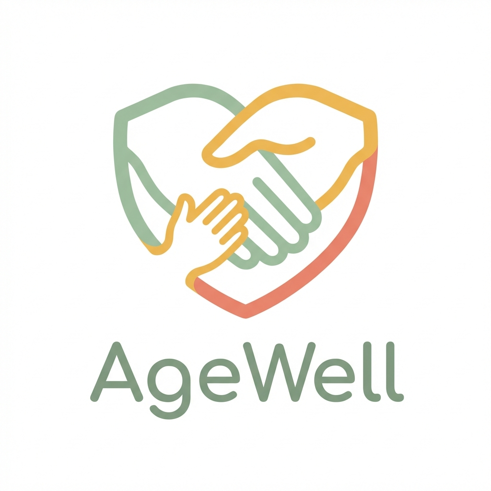

# AgeWell

AI-powered elderly care platform for medication adherence, health monitoring, assistive diagnosis, and caregiver collaboration.



## Table of Contents

1. [What AgeWell Solves](#what-agewell-solves)
2. [Core Capabilities](#core-capabilities)
3. [Product Screens](#product-screens)
4. [System Architecture](#system-architecture)
5. [Tech Stack](#tech-stack)
6. [Repository Structure](#repository-structure)
7. [Getting Started (Local Development)](#getting-started-local-development)
8. [Environment Variables](#environment-variables)
9. [Diagnosis Flow (Assistive Diagnosis)](#diagnosis-flow-assistive-diagnosis)
10. [API Overview](#api-overview)
11. [Deployment Notes](#deployment-notes)
12. [Documentation Index](#documentation-index)
13. [Contributing](#contributing)
14. [License](#license)

## What AgeWell Solves

AgeWell is designed for elders and caregivers who need a single system for daily wellness operations:
- medication reminders and adherence history
- vital tracking and risk signals
- lightweight symptom triage support (not a medical diagnosis)
- caregiver visibility and alerts
- prescription upload and OCR-assisted extraction

The project combines a React frontend, Flask APIs, Supabase-backed persistence, and AI service integrations.

## Core Capabilities

### Elder Experience
- Large, touch-friendly interface and simplified interaction patterns
- Daily medication schedule with adherence logging
- Health check-ins and status visibility
- Emergency support actions
- Assistive diagnosis intake and report export/share

### Caregiver Experience
- Linked elder management
- Dashboard with recent health and medication events
- Diagnosis history visibility and follow-up support
- Medication and schedule management
- Notification and escalation context

### Clinical Utility
- Structured diagnosis reports for doctor conversations
- PDF export for symptom history handoff
- History retrieval for recent sessions

## Product Screens

> Existing project images are preserved and included below.

### Landing


### Dashboard and Daily Usage


### Caregiver and Operations


## System Architecture

```text
Frontend (React + Vite)
  ├─ Auth context, route guards, role-aware navigation
  ├─ Elder and caregiver page flows
  └─ API client (frontend/src/api/client.js)
            │
            ▼ REST
Backend (Flask Blueprints)
  ├─ health_routes
  ├─ medication_routes
  ├─ diagnosis_routes
  ├─ prescription_routes
  ├─ linking_routes
  ├─ settings_routes
  └─ notification/automation routes
            │
            ▼
Supabase (PostgreSQL + Auth + RLS)
```

The diagnosis module combines:
1. Complaint intake
2. Symptom extraction + first question generation (Groq-backed with safe fallback logic)
3. Yes/No follow-up sequence (max 8)
4. Optional image observation (Gemini)
5. Structured urgency report + share/export

## Tech Stack

| Layer | Tools |
|---|---|
| Frontend | React 18, Vite, TailwindCSS, Framer Motion, Lucide |
| Backend | Flask, Flask-CORS, SQLAlchemy, ReportLab |
| Data | Supabase PostgreSQL, Supabase Auth |
| AI Services | Groq (text triage/report), Gemini (image analysis) |
| OCR | Tesseract + pytesseract |
| Notifications | Twilio-based channels |

## Repository Structure

```text
agewell/
├─ frontend/                 # React app
│  ├─ src/
│  │  ├─ pages/
│  │  ├─ components/
│  │  ├─ contexts/
│  │  └─ api/
│  └─ public/
├─ backend/                  # Flask API
│  ├─ app.py
│  ├─ routes/
│  └─ services/
├─ supabase/                 # SQL and schema assets
├─ docs/                     # Architecture, API, deployment docs
└─ stitch_elder_dashboard/   # Product screenshot assets
```

## Getting Started (Local Development)

### Prerequisites
- Python 3.10+
- Node.js 18+
- Supabase project credentials
- Tesseract OCR installed on machine

### 1. Backend setup

```bash
cd backend
python -m venv venv
# Windows
.\venv\Scripts\activate
# macOS/Linux
# source venv/bin/activate

pip install -r requirements.txt
copy .env.example .env
python app.py
```

Backend runs on `http://localhost:5001`.

### 2. Frontend setup

```bash
cd frontend
npm install
copy .env.example .env
npm run dev
```

Frontend runs on `http://localhost:5173` by default.

## Environment Variables

Use `.env.example` in both `frontend/` and `backend/` as starting templates.

### Backend (typical)
- `SUPABASE_URL`
- `SUPABASE_SERVICE_KEY` (or `SUPABASE_SECRET_KEY` / `SUPABASE_SERVICE_ROLE_KEY`)
- `GROQ_API_KEY` (fallback when user-level key is not set)
- `GEMINI_API_KEY` (fallback when user-level key is not set)
- `SECRET_KEY`
- `FLASK_DEBUG`

### Frontend (typical)
- `VITE_API_URL`
- `VITE_SUPABASE_URL`
- `VITE_SUPABASE_ANON_KEY`

## Diagnosis Flow (Assistive Diagnosis)

User path:
1. Open `/diagnosis/input`
2. Submit raw complaint text
3. Receive first yes/no question
4. Continue question flow in `/diagnosis/qa`
5. Auto-generate report at completion
6. Review/export/share via `/diagnosis/report` and `/diagnosis/history`

Reliability behavior:
- If AI is unavailable, diagnosis still starts with a safe symptom-focused fallback first question.
- Follow-up flow can continue with deterministic dynamic fallback prompts.
- API key resolution for diagnosis uses user settings first, then request-header overrides, then environment fallback in service layer.

## API Overview

Base URL (local): `http://localhost:5001/api`

Key diagnosis endpoints:
- `POST /diagnosis/start`
- `POST /diagnosis/answer`
- `POST /diagnosis/upload-image`
- `POST /diagnosis/generate-report`
- `GET /diagnosis/history/{patient_id}`
- `GET /diagnosis/export-pdf/{session_id}`
- `GET /diagnosis/audit/{session_id}`
- `POST /diagnosis/share`

See full references in [docs/API.md](docs/API.md).

## Deployment Notes

Deployment options and infra steps are documented in [docs/DEPLOYMENT.md](docs/DEPLOYMENT.md), including:
- Supabase configuration
- Backend deployment patterns (Railway/Render/VPS/Docker)
- Frontend static hosting
- Runtime environment setup

## Documentation Index

- [Architecture](docs/ARCHITECTURE.md)
- [Frontend Guide](docs/FRONTEND.md)
- [Backend Guide](docs/BACKEND.md)
- [API Reference](docs/API.md)
- [Database Schema](docs/DATABASE.md)
- [Deployment Guide](docs/DEPLOYMENT.md)
- [Contributing](docs/CONTRIBUTING.md)
- [Graphify Notes](docs/GRAPHIFY.md)

## Contributing

Please follow [docs/CONTRIBUTING.md](docs/CONTRIBUTING.md) for branch strategy, code standards, and documentation expectations.

## License

MIT License. See [LICENSE](LICENSE) if present in your checkout.
