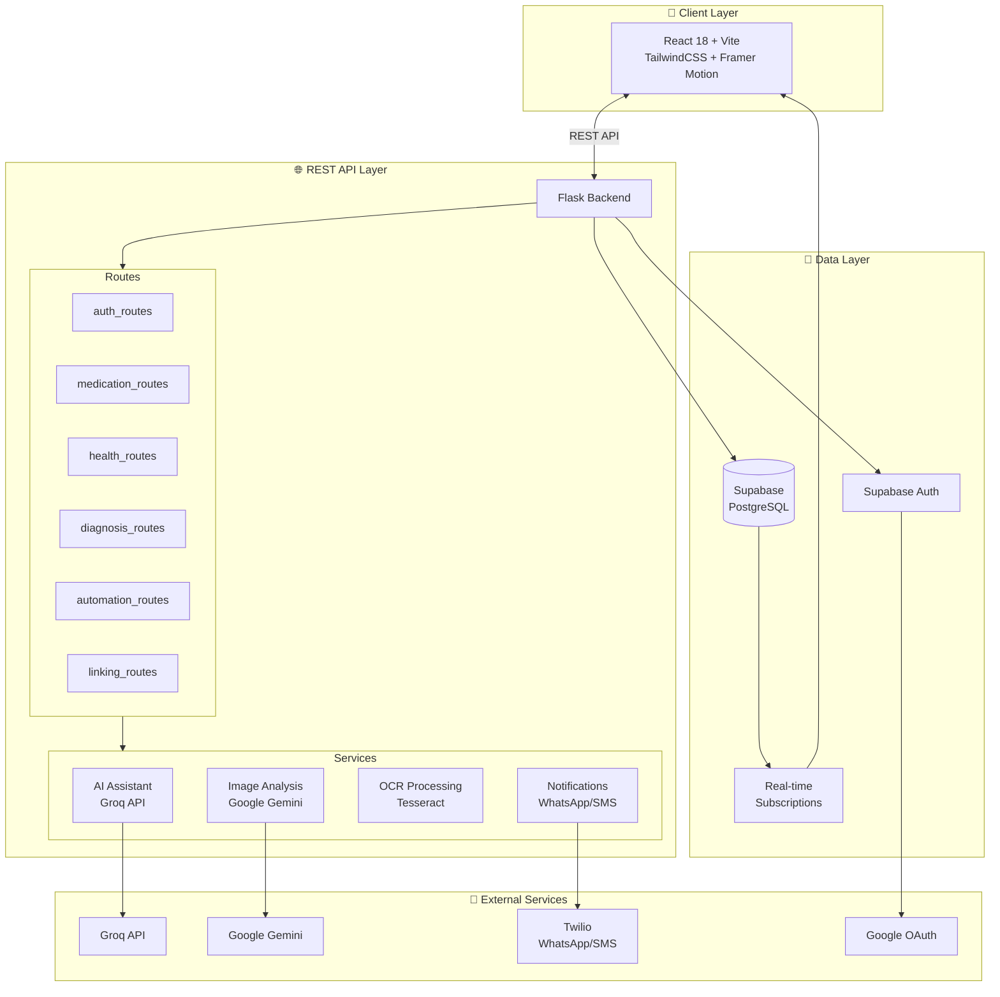
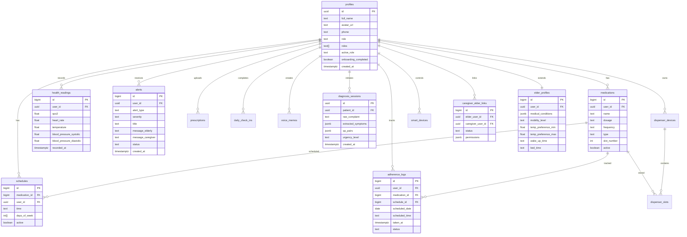
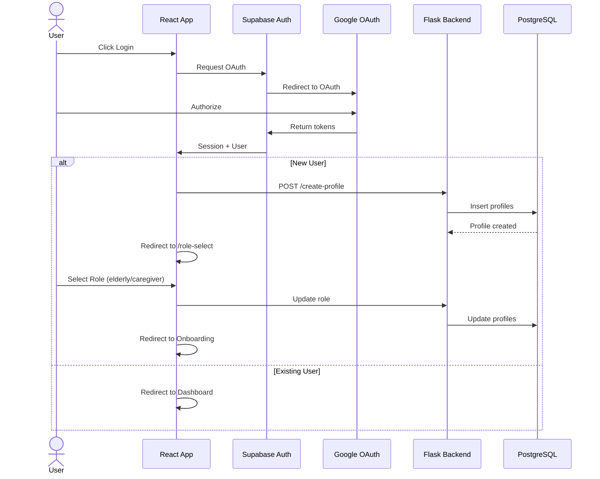
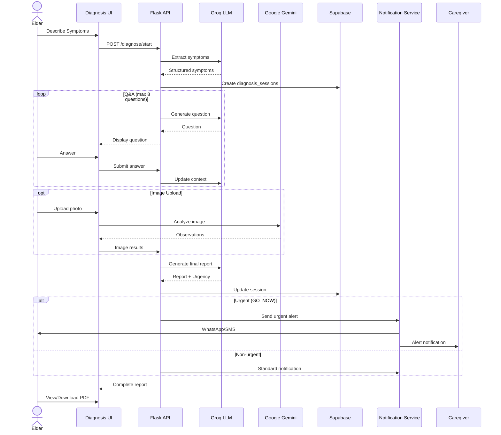
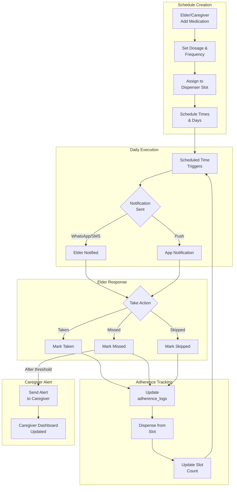
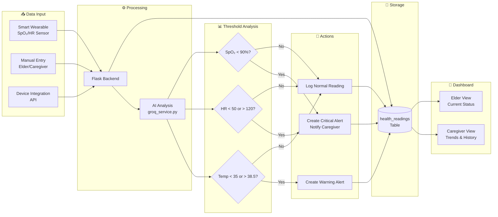
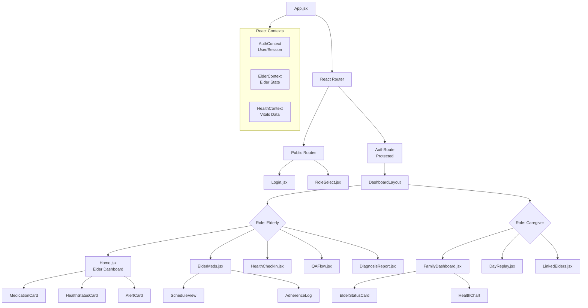
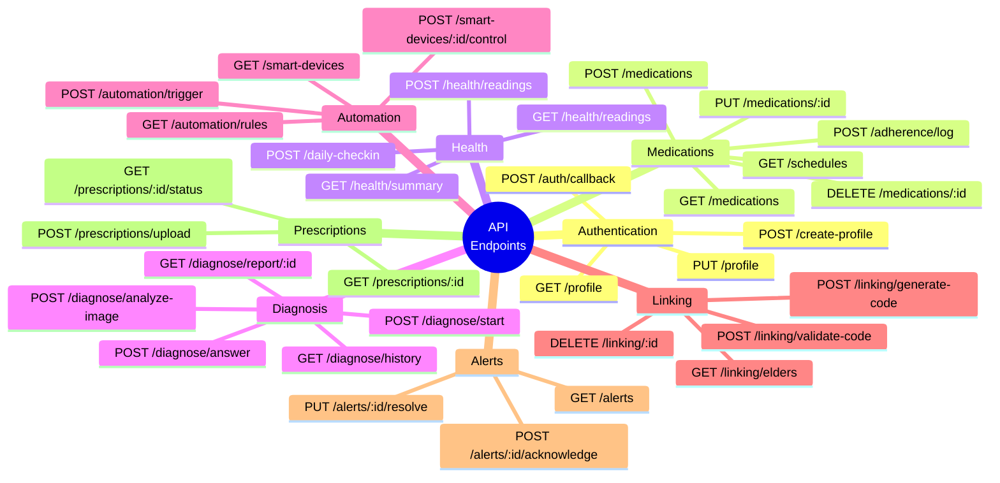
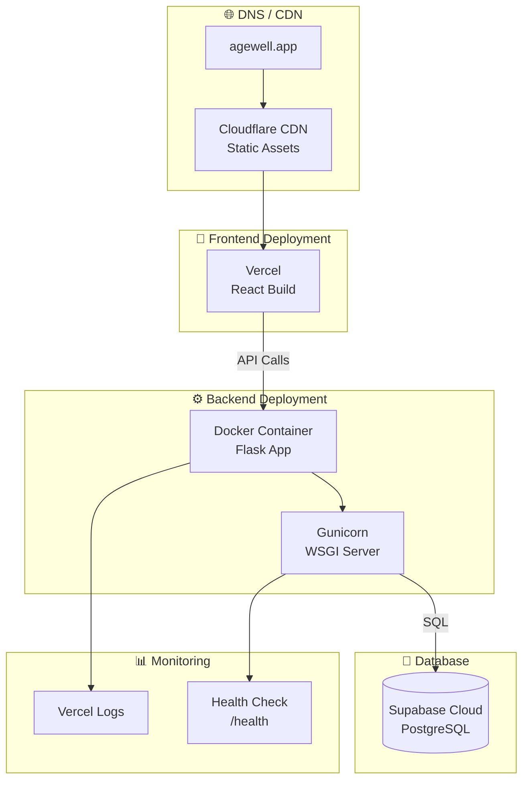

# AgeWell - Visual Architecture & Data Flows

> Graphified documentation of the AgeWell elderly care platform.

---

## 1. System Architecture



---

## 2. Database Entity Relationship



---

## 3. User Authentication Flow



---

## 4. AI Diagnosis Flow



---

## 5. Medication Adherence Flow



---

## 6. Health Monitoring Data Flow



---

## 7. Caregiver-Elder Linking Flow

```mermaid
stateDiagram-v2
    [*] --> Onboarding: Caregiver signs up

    Onboarding --> Dashboard: Complete profile

    Dashboard --> GenerateCode: Click "Add Elder"
    GenerateCode --> CodeGenerated: 6-digit code created
    CodeGenerated --> ElderEntersCode: Share code with elder

    ElderEntersCode --> ValidateCode: Elder enters code
    ValidateCode --> Pending: Code valid
    ValidateCode --> CodeGenerated: Code invalid/retry

    Pending --> Active: Caregiver confirms
    Pending --> Cancelled: Timeout/declined

    Active --> Dashboard: Link established
    Active --> ViewData: Caregiver can view:

    ViewData --> Medications: Medication schedule
    ViewData --> HealthReadings: Vitals history
    ViewData --> Alerts: Alert history
    ViewData --> DailyStatus: Daily check-ins

    Cancelled --> GenerateCode: Retry
    Cancelled --> [*]: Abandon

    Active --> RemoveLink: Unlink
    RemoveLink --> Dashboard: Elder removed
```

---

## 8. Component Hierarchy (Frontend)



---

## 9. API Endpoint Map



---

## 10. Deployment Architecture



---

## Legend

| Symbol | Meaning |
|--------|---------|
| `||--o{` | One-to-Many relationship |
| `||--||` | One-to-One relationship |
| `PK` | Primary Key |
| `FK` | Foreign Key |
| `->>` | Async/HTTP Call |
| `-->>` | Response |
| `-->` | Sync Call/Flow |

---

> Generated with ❤️ for AgeWell documentation
